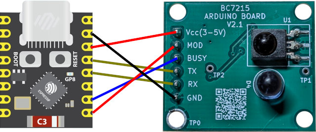

# ESPHome Universal A/C IR Control (Powered by BC7215)

This ESPHome project turns an ESP32 module combined with a BC7215 module into a universal A/C IR remote control that integrates seamlessly with Home Assistant. It supports one-step pairing with almost any air conditioner.

You can control your air conditioner through Home Assistant if:

- **Your air conditioner uses an IR remote control.**

- **The original AC remote features an LCD screen that displays the temperature.**

**Bonus:** Any operations made using the original IR remote will also be synchronized back to Home Assistant in real time!

## Installation Methods

There are two ways to install the firmware on your ESP32:

### Method 1: Web Install (Recommended)

This is the easiest and fastest way to get your device up and running. No ESPHome installation or command-line operations are required—everything is done directly in your web browser.

*Note: The only limitation is that your hardware setup must match the default configuration. This method specifically requires an **ESP32-C3** module, and you must connect it to the exact GPIO pins specified on the web page. (Using an ESP32-C3 Super Mini module is recommended for a seamless experience).*

For the **ESP32-C3 Super Mini**, connect it to the BC7215 module as shown below:



Once the hardware is ready, open the following page and follow the on-screen instructions:

[https://timj-code.github.io/bc7215_ac_esphome/](https://timj-code.github.io/bc7215_ac_esphome/)

### Method 2: Clone and Compile (Custom Setup)

This method allows you to use any ESP32 variant and customize the GPIO pins to your preference. You will just need to modify the hardware configurations in the `bc7215_ac_ctrl.yaml` file.

Platform definition section:

```yaml
esp32:
  variant: esp32c3
```

BC7215 module pin definition section:

```yaml
climate:

- platform: bc7215_ac
  id: ac_controller
  name: "Air Conditioner"

  bc7215_uart_num: 1
  bc7215_tx_pin: GPIO3
  bc7215_rx_pin: GPIO4
  bc7215_busy_pin: GPIO1
  bc7215_mod_pin: GPIO0
```

****Important Note:** Do not select a UART port that conflicts with the download/programming port. Also, avoid using GPIO pins that are already assigned to other hardware components (such as LCDs, LEDs, or buttons).

#### Step 1: Clone the project

Because this project relies on git submodules (the AC control library and examples from [GitHub - bitcode-tech/bc7215_ac_lib · GitHub](https://github.com/bitcode-tech/bc7215_ac_lib)), **do not download it as a ZIP file**. You must use the `git clone --recursive` command to fetch all required dependencies:

```bash
git clone --recursive https://github.com/timj-code/bc7215_ac_esphome.git
```

#### Step 2: Modify hardware settings

Open `bc7215_ac_ctrl.yaml` and adjust the processor type and I/O pin configurations to match your specific hardware setup.

#### Step 3: Configure Wi-Fi

Rename the `secrets.yaml.template` file to `secrets.yaml`, then open it and enter your Wi-Fi SSID and password.

#### Step 4: Compile & Install

Run the following command in the project root directory:

```bash
esphome run bc7215_ac_ctrl.yaml
```

Alternatively, you can launch the ESPHome dashboard:

```bash
esphome dashboard ./
```

And complete the installation via your browser.

*Note: The **first** installation must be done via a physical USB-to-serial connection. Subsequent updates can be done over-the-air (OTA), so you won't need to plug the device into your computer again.*

## Usage & Pairing Guide

Once the hardware is connected and the firmware is flashed, a new air conditioner device will appear in Home Assistant. This device includes:

- A climate control entity (A/C controller)

- Two action buttons

- A Text Sensor to display real-time status info

### How to Pair

Before you can control your A/C, you must pair the module with your unit. This is a simple one-step process that doesn't require knowing your A/C's brand or model, as the underlying library automatically detects the IR protocol.

To pair, you need to transmit a specific IR signal from your original remote to the BC7215 module. **The remote must be set to Cooling Mode at 25°C.**

> (Note for Fahrenheit users: If your A/C uses Fahrenheit, set it to 78°F. You may also need to adjust the configuration in your YAML file. Since I don't own a Fahrenheit-based A/C, this mode is currently untested—feedback is highly welcome!)

### Pairing Steps:

1. Set your original A/C remote to **Cooling Mode at 25°C**.

2. Look at your device's interface in Home Assistant (it should look similar to the image below):
   
   

3. Click the **Pair Button** in Home Assistant. The Text Sensor will update to:
   
   > `Pairing: press Fan with 25°C/Cool mode`

4. The blue LED on the BC7215 module will light up. Now, point your original remote at the module and press the **Fan Speed** button.

5. Pairing is usually instantaneous (though Home Assistant might take a brief second to reflect the state). Once successful, the status will update to:
   
   > 1. `AC Paired`

You can now fully control your air conditioner via Home Assistant! The blue LED on the BC7215 module will remain illuminated, indicating it is continuously listening for IR signals. This allows Home Assistant to stay perfectly in sync whenever you use the original physical remote.


#### What does the "Alt Button" do?

According to the BC7215 AC library documentation, a small number of air conditioners may fail to pair, or may pair successfully but still cannot control the AC. **This button is only intended to be used in such situations.** In my program design, each press switches to another built-in special protocol and sends a test signal. If you find that the air conditioner responds after switching to a certain protocol, that should be the setting capable of controlling your air conditioner. Since I have not encountered an air conditioner that cannot be controlled, I have not been able to test this feature myself. Feedback from users who encounter this situation would be appreciated.
