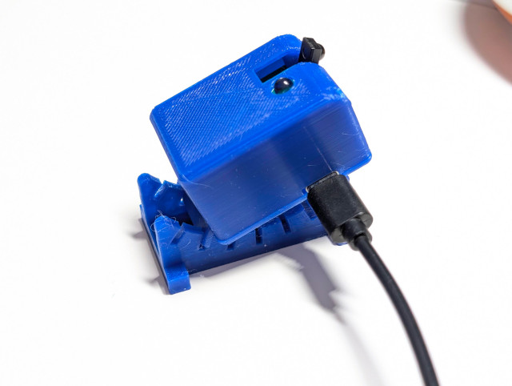
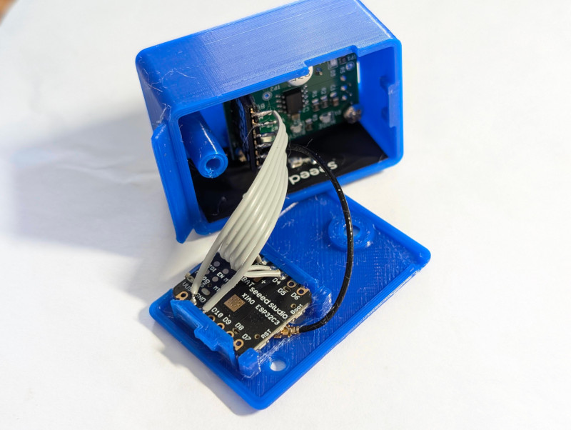

# Case Assembly Instructions

To make this project closer to a real product, I spent about a week learning 3D modeling software and finally designed this enclosure. The design philosophy mainly revolves around the following points:

1. Keep each module in its existing form as much as possible, making minimal modifications.
2. The placement angle must be adjustable to adapt to different usage environments.

The final design consists of 3 parts. The main case is composed of a top cover and a bottom cover. The BC7215 module and the ESP32 module are fixed to the top and bottom covers, respectively. The base bracket has slots of different angles, allowing you to adjust the angle of the infrared (IR) transmitter LED.

In this update, the case was modified a little bit (3mm longer) so you can stick the antenna on the inner wall -- perfect!

2 separate files for the bottom part: one for XIAO, another one for Super Mini, there are 2 holes on the bottom cover, they are reserved for the up coming Matter version, not used for this ESPHome project. Top part is shared.

## Why Do We Need to Adjust the Angle?

The device needs to both transmit IR signals and receive signals from the original remote control for decoding and syncing to HA. Therefore, when using the device, the ideal position should allow the transmitted IR to be received by the air conditioner while also being able to receive the remote control's signal at any time. Because infrared light is directional, if the device is placed facing away from the IR remote control, reception will be highly unstable or completely impossible. Therefore, the best placement position is near the air conditioner, such as on a desk underneath it. This way, no matter which direction you use the remote control from within the room, as long as the air conditioner can receive it, this device can also receive it at the same time.

Unfortunately, the BC7215 module is designed with the IR transmitter and receiver pointing in the same direction, which makes it difficult to achieve our goal. This is the only place where we need to modify the module. The modification is very simple: you just need to stand up the originally flat-lying IR receiver! (See the assembly photos; be careful not to adjust the angle of the receiver head too frequently to prevent the pins from breaking).

Installing the BC7215 module requires screws, and the maximum length of the screws should not exceed 5mm. The ESP32 XIAO or Super Mini module slides in from the side along the slot; you must use a version without soldered pin headers, otherwise, it will not fit.

Two holes for a button and an LED are reserved on the bottom cover, which are prepared for the upcoming Matter protocol version, as both share the same hardware. Here is a quick plug: The Matter protocol version will break free from reliance on Home Assistant (though it can still connect to Home Assistant, of course). Without any other IoT environment—requiring only a smartphone—you can turn any air conditioner into a smart one, controlled directly by smart assistants like Siri. While the current ESPHome version relies on having an existing HA environment set up at home, the upcoming Matter version only relies on a smartphone. So you could even make it as a little gift for any of your friends!

Case installation is very simple; the rest can be easily understood by looking at the pictures!

